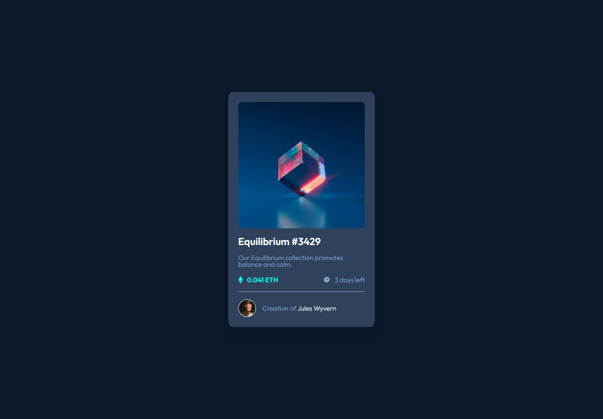

# Frontend Mentor - NFT preview card component solution

This is a solution to the [NFT preview card component challenge on Frontend Mentor](https://www.frontendmentor.io/challenges/nft-preview-card-component-SbdUL_w0U). Frontend Mentor challenges help you improve your coding skills by building realistic projects. 

## Table of contents

- [Overview](#overview)
  - [The challenge](#the-challenge)
  - [Screenshot](#screenshot)
  - [Links](#links)
- [My process](#my-process)
  - [Built with](#built-with)
- [Author](#author)

## Overview

### The challenge

Users should be able to:

- View the optimal layout depending on their device's screen size
- See hover states for interactive elements

### Screenshot

### Links

- Solution URL: [Frontend Mentor Solution](https://www.frontendmentor.io)
- Live Site URL: [View Live Demo](https://izhal27.github.io/nft-preview-card-component/)

## My process

### Built with

- Semantic HTML5 markup
- Pure CSS
- Flex Layout
- Mobile-first workflow

## Author

- Website - [Risal Walangadi](https://izhal.web.id/)
- Frontend Mentor - [@izhal27](https://www.frontendmentor.io/profile/izhal27)
- Twitter - [@Gooner_IzHaL](https://www.twitter.com/Gooner_Izhal)